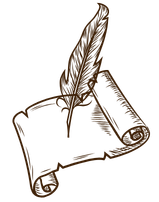
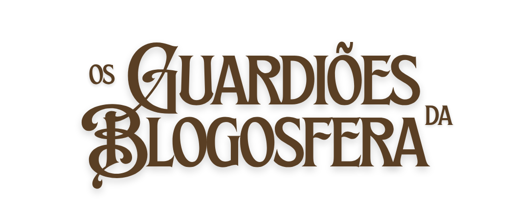
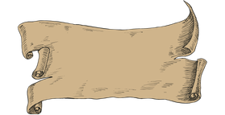
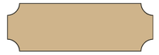
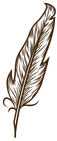

<html lang="pt">
<head>
<meta charset="UTF-8">
<meta name="viewport" content="width=device-width, initial-scale=1.0">

<link rel="preconnect" href="https://fonts.googleapis.com">
<link rel="preconnect" href="https://fonts.gstatic.com" crossorigin>
<link href="https://fonts.googleapis.com/css2?family=Jim+Nightshade&display=swap" rel="stylesheet">
<link href="https://fonts.googleapis.com/css2?family=Special+Elite&display=swap" rel="stylesheet">

<link rel="apple-touch-icon" sizes="180x180" href="https://entreblogs.com.br/assets/favicon/selo_1_marron.png">
<link rel="icon" type="image/png" sizes="32x32" href="https://entreblogs.com.br/assets/favicon/selo_1_marron.png">
<link rel="icon" type="image/png" sizes="16x16" href="https://entreblogs.com.br/assets/favicon/selo_1_marron.png">

<link rel="manifest" href="/site.webmanifest">
<link rel="stylesheet" href="..\..\style\beda2026-recrutamento.css">

</head>

<body>

    
	
    
	

<section class="classes-page">

    <header class="classes-header">

        <h1 class="titulo-pagina">
        	Escolha a sua Jornada
    	</h1>

    

            Nem todos os aventureiros percorrem a mesma estrada. 
		  
			Alguns caminham lado a lado com a guilda do primeiro ao último dia. Outros seguem por trilhas alternativas ou aparecem nos momentos em que o destino cruza seus caminhos. 
		  
			Nesta campanha, toda jornada é válida. 
		  
			Escolha aquela que melhor combina com você.

        

    </header>

    

         <!-- CRONISTA -->

            <article class="classe-card">

                

                    

                    <h2>Herói</h2>

                

                

			
31 dias • A campanha completa
 
			
Você decidiu aceitar a missão principal.

			Durante todo o mês de agosto, percorrerá uma nova etapa da aventura a cada dia, escrevendo uma postagem diária e ajudando a manter viva a chama da criatividade.  
			
Missão: tentar publicar todos os dias de agosto.

                

            </article>

            <!-- PATRULHEIRO -->

            <article class="classe-card">

                

                    

                    <h2>Patrulheiro</h2>

                

                

				
<a href="https://porce-lana.blogspot.com/p/bewa-main-page-crosscol.html"> Formato BEWA • Uma parada por semana</a>
 
				
Percorre o reino em rondas periódicas.

				Segue seu próprio ritmo, faz pausas para observar o caminho e retorna sempre que encontra uma nova história para contar.  
				
Missão: publicar pelo menos uma vez por semana durante agosto.

                

            </article>

            <!-- ANDARILHO -->

            <article class="classe-card">

                

                    

                    <h2>Andarilho</h2>

                

                

				
Quando o coração indicar o caminho
 
				
O Andarilho não segue mapas nem calendários.

				Ele aparece quando encontra uma boa história, um tema inspirador ou simplesmente quando sente vontade de escrever.
				Cada encontro com a guilda fortalece a aventura.  
				
Missão: participar sempre que desejar.

                

            </article>

    

</section>

<section class="classes-page">

    <header class="classes-header">

 		<h1 class="titulo-pagina">
			Classes    	
		</h1>

   		 

            Descubra as seis classes disponíveis na campanha
            Guardiões da Blogosfera.
        

    </header>

    

         <!-- CRONISTA -->

            <article class="classe-card">

                

                    

                    <h2>Cronista</h2>
	
                

                

					

					  <strong>O contador de histórias da guilda</strong> 
					  <em>Registra acontecimentos, transforma momentos em narrativas e guarda as memórias da jornada.</em>
					

					

					  <strong>Combina com:</strong> 
					  blogs pessoais 
					  textos reflexivos 
					  diários 
					  relatos
					

					

					  <strong>Habilidade especial:</strong> <em>transformar experiências comuns em histórias.</em>
					

				
                

            </article>

            <!-- EXPLORADOR -->

            <article class="classe-card">

                

                    

                    <h2>Explorador</h2>

                

                

					

					  <strong>O viajante que segue caminhos desconhecidos</strong> 
					  <em>Entra em territórios novos, testa ideias diferentes e descobre assuntos pelo caminho.</em>
					

					

					  <strong>Combina com:</strong> 
					  desafios criativos 
					  posts variados 
					  descobertas 
					  resenhas
					

					

					  <strong>Habilidade especial:</strong> <em>encontrar inspiração onde ninguém procurou.</em>
					

                

            </article>

            <!-- ARTÍFICE -->

            <article class="classe-card">

                

                    

                    <h2>Artífice</h2>

                

                

					

					  <strong>O criador de artefatos e invenções</strong> 
					  <em>Constrói coisas novas usando criatividade, ferramentas e imaginação.</em>
					

					

					  <strong>Combina com:</strong> 
					  DIY 
					  arte 
					  fotografia 
					  design 
					  projetos
					

					

					  <strong>Habilidade especial:</strong> <em>transformar ideias em algo concreto.</em>
					

                

            </article>

            <!-- ORÁCULO -->

            <article class="classe-card">

                

                    

                    <h2>Oráculo</h2>

                

                

					

					  <strong>Aquele que enxerga histórias escondidas</strong> 
					  <em>Observa o mundo ao redor e revela significados que estavam ocultos.</em>
					

					

					  <strong>Combina com:</strong> 
					  reflexões 
					  ensaios 
					  análises 
					  opiniões
					

					

					  <strong>Habilidade especial:</strong> <em>encontrar profundidade nas pequenas coisas.</em>
					

                

            </article>

            <!-- BARDO -->

            <article class="classe-card">

                

                    

                    <h2>Bardo</h2>

                

                

					

					  <strong>O artista que carrega histórias pelo mundo</strong> 
					  <em>Usa palavras, imagens e emoções para encantar outros viajantes.</em>
					

					

					  <strong>Combina com:</strong> 
					  poesia 
					  escrita criativa 
					  música 
					  cultura
					

					

					  <strong>Habilidade especial:</strong> <em>transformar sentimentos em arte.</em>
					

                

            </article>

            <!-- ARQUIVISTA -->

            <article class="classe-card">

                

                    

                    <h2>Arquivista</h2>

                

                

					

					  <strong>Guardião dos conhecimentos perdidos</strong> 
					  <em>Coleciona informações, organiza descobertas e compartilha tesouros encontrados.</em>
					

					

					  <strong>Combina com:</strong> 
					  livros 
					  filmes 
					  estudos 
					  listas 
					  recomendações
					

					

					  <strong>Habilidade especial:</strong> <em>nunca deixar uma boa descoberta esquecida.</em>
					

                

            </article>

    

</section>

<section class="class-progression">

    

        
Como evoluir meu personagem?

        

            Cada vez que você publica, sua experiência aumenta.
            Ao atingir novos marcos de participações, você recebe um novo título.
			 
        

        <table class="progression-table">
            <thead>
                <tr>
                    <th></th>
                    <th>Nível I</th>
                    <th>Nível II</th>
                    <th>Nível III</th>
                </tr>
            </thead>

            <tbody>
                <tr>
                    <td>📜 Cronista</td>
                    <td>Aprendiz de Pergaminhos</td>
                    <td>Escriba da Guilda</td>
                    <td>Guardião das Crônicas</td>
                </tr>

                <tr>
                    <td>🗺️ Explorador</td>
                    <td>Aprendiz dos Caminhos</td>
                    <td>Desbravador</td>
                    <td>Guardião dos Mapas</td>
                </tr>

                <tr>
                    <td>🎨 Artífice</td>
                    <td>Aprendiz das Criações</td>
                    <td>Artesão</td>
                    <td>Guardião das Criações</td>
                </tr>

                <tr>
                    <td>🔮 Oráculo</td>
                    <td>Aprendiz dos Presságios</td>
                    <td>Vidente</td>
                    <td>Guardião dos Segredos</td>
                </tr>

                <tr>
                    <td>🎭 Bardo</td>
                    <td>Aprendiz das Canções</td>
                    <td>Trovador</td>
                    <td>Guardião das Lendas</td>
                </tr>

                <tr>
                    <td>📚 Arquivista</td>
                    <td>Aprendiz dos Arquivos</td>
                    <td>Criador de Teorias</td>
                    <td>Guardião dos Conhecimentos</td>
                </tr>
            </tbody>
        </table>

    

</section>

    <a
        href="https://docs.google.com/forms/d/e/1FAIpQLSd429xM_X3lgFEwvWYquDAp89JOCes4C0lBd7gB0XjlmZjoyQ/viewform"
        target="_blank"
        rel="noopener"
        class="attack-button">

        Quero me inscrever!

    </a>

    
	

        <h3>
            Aventureiros Registrados
        </h3>

        

            Aqueles que aceitaram o chamado e partiram
            em busca das histórias esquecidas.
        

    

<!-- ==========================================================
     LISTA DOS PARTICIPANTES (sem popup, direto na página)
========================================================== -->

    

        

            Consultando os registros da Biblioteca Eterna...
        

    

<!-- tooltip único, fora da grade — nunca é cortado por overflow de nenhum contêiner -->

    
    

</body>

</html>
